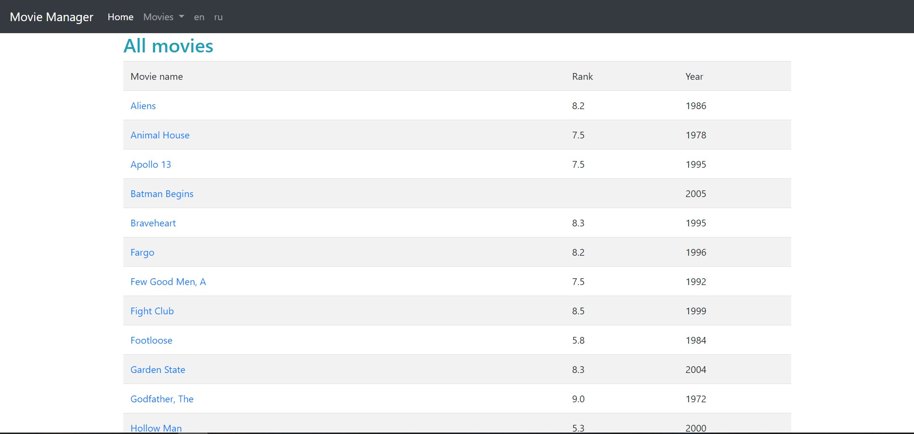
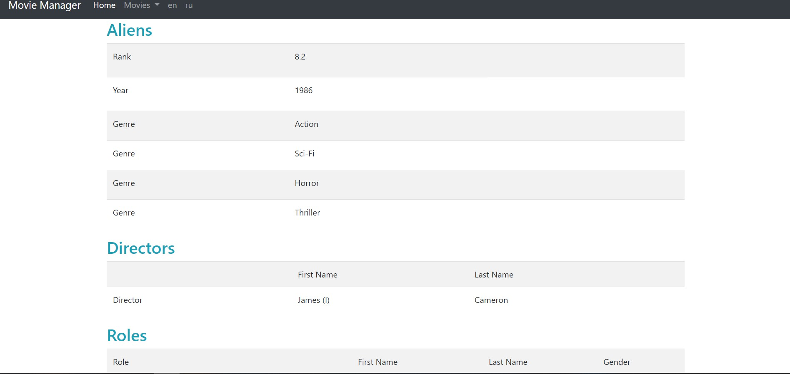
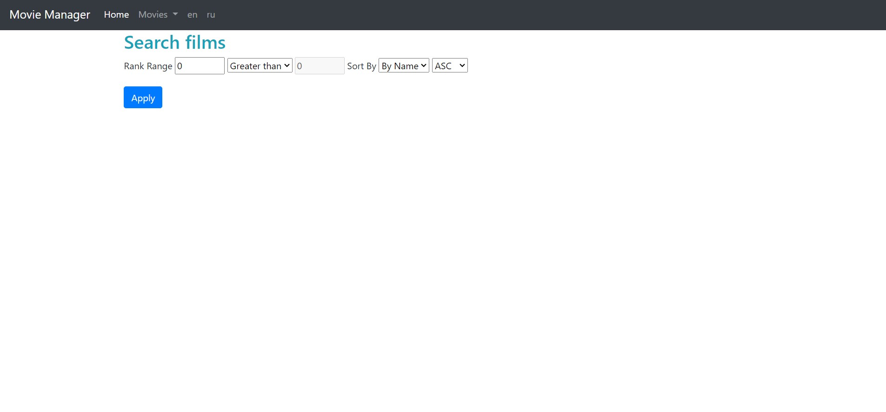

# Spring Framework project for IMDB movies

## Installation & Usage

```bash
$ git clone https://github.com/vlad777442/spring-imdb
```
* Launch XAMPP;
* Start Apache & MySQL PhpMyAdmin;
* Create database imdb_small and import imdb_small.sql file 
in PhpMyAdmin;
* Create and configure Tomcat Local Server in Intellij Idea;
* Launch application.



